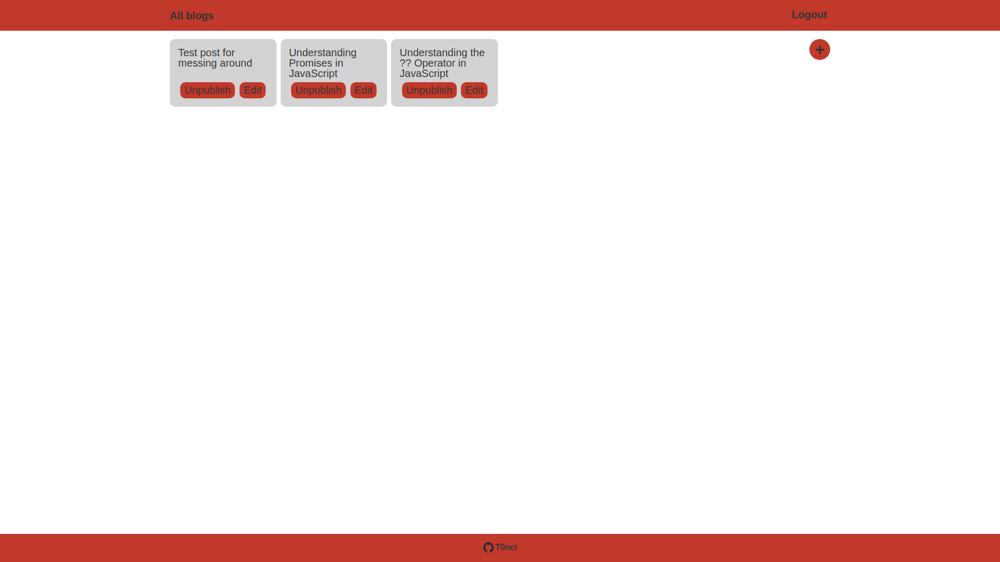
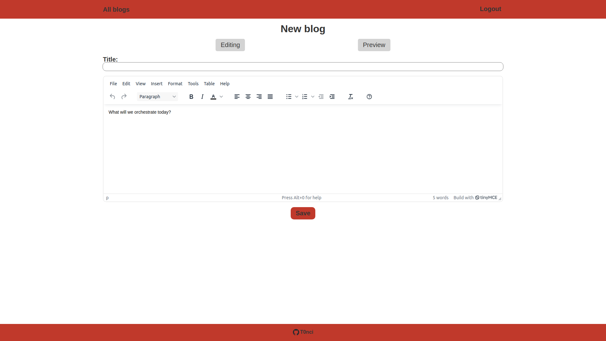
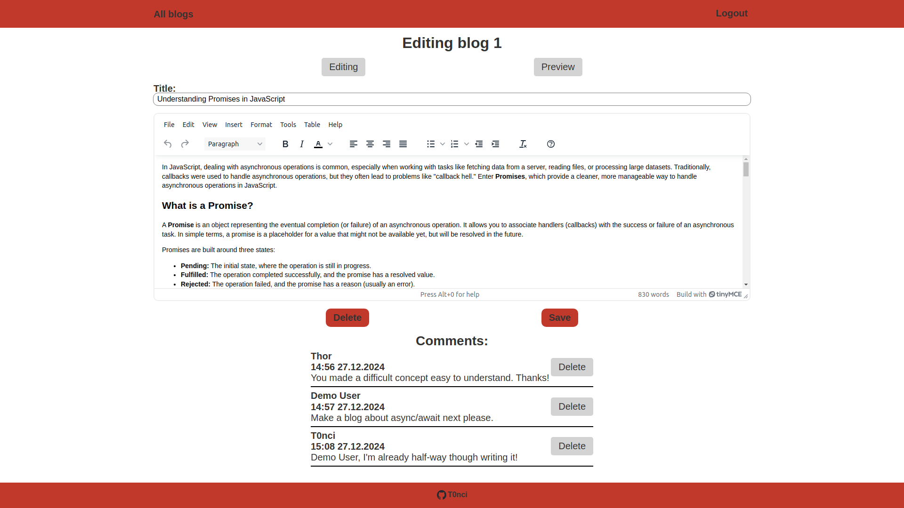
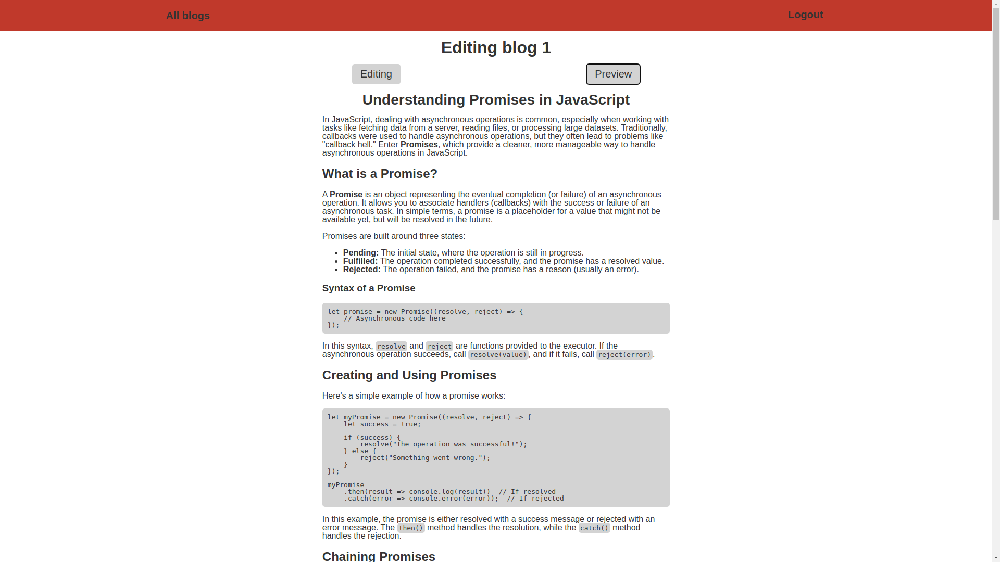

# Blog API CMS

This is the CMS Front-End for the [Blog API](https://github.com/T0nci/odin-blog-api).

## Live Preview

[Live Preview link](https://odin-blog-author.vercel.app/)

## Demo

- Login page 
- All blogs page 
- Creating a blog 
- Editing a blog 
- Previewing a blog 

### Prerequisites

- Setup and run a [Blog API server](https://github.com/T0nci/odin-blog-api?tab=readme-ov-file#installation)
- [TinyMCE API key](https://www.tiny.cloud/auth/login/?redirect_to=%2Fmy-account%2Fintegrate%2F)

### Setup and running locally

1. Clone the repo:
   ```bash
   git clone git@github.com:T0nci/odin-blog-author.git
   ```
   The above example is cloning through SSH, this can be done through HTTPS as well:
   ```bash
   git clone https://github.com/T0nci/odin-blog-author.git
   ```
2. Install NPM packages:
   ```bash
   npm install
   ```
3. Create `.env` file and set the following environment variables with values that follow the instructions:
   ```dotenv
   VITE_API_URL='THE URL ON WHICH THE BLOG API IS RUNNING'
   VITE_TINYMCE_API='THE API KEY FROM YOUR TINYMCE ACCOUNT'
   ```
4. Start the server:
   ```bash
   npm run dev
   ```

And your server should have started. Visit your server by running the following command in the same terminal as the 4th step and then pressing enter.

```bash
o
```

## License

[MIT](LICENSE.txt)

[(back to top)](#blog-api-cms)
